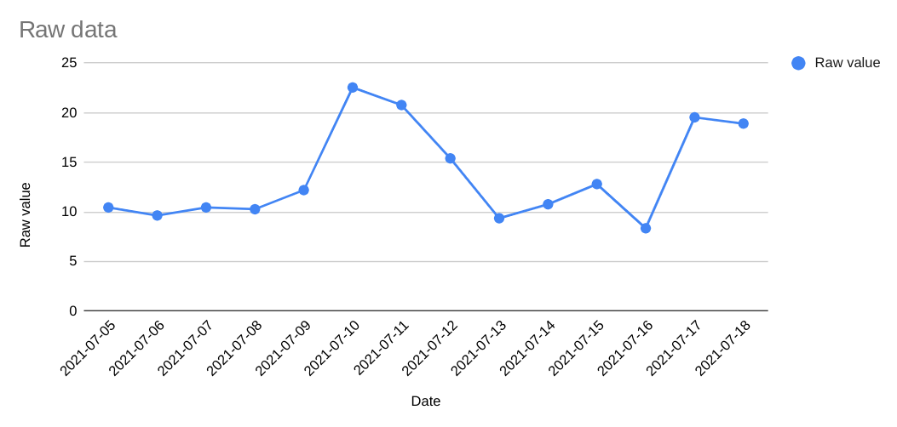
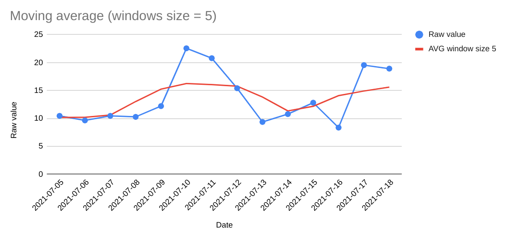
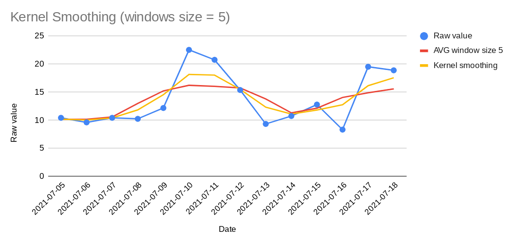

[Back to my projects page](/)

[Back to Coding in SQL](/sql-code)

# Circular kernel smoothing in SQL

## Smoothing things over (simple case)

Lets generate some data - we look at a noisy (and jittery) signal over a few days:

```sql
CREATE OR REPLACE TABLE measurements AS
SELECT *
FROM (VALUES
    (1001, CAST('2021-07-05' AS DATE), 10.45),
    (1001, CAST('2021-07-06' AS DATE), 9.64),
    (1001, CAST('2021-07-07' AS DATE), 10.45),
    (1001, CAST('2021-07-08' AS DATE), 10.27),
    (1001, CAST('2021-07-09' AS DATE), 12.2),
    (1001, CAST('2021-07-10' AS DATE), 22.55),
    (1001, CAST('2021-07-11' AS DATE), 20.78),
    (1001, CAST('2021-07-12' AS DATE), 15.4),
    (1001, CAST('2021-07-13' AS DATE), 9.36),
    (1001, CAST('2021-07-14' AS DATE), 10.77),
    (1001, CAST('2021-07-15' AS DATE), 12.81),
    (1001, CAST('2021-07-16' AS DATE), 8.35),
    (1001, CAST('2021-07-17' AS DATE), 19.54),
    (1001, CAST('2021-07-18' AS DATE), 18.91)
) AS t(user_id, date, measurement)

```

```sql
SELECT date, measurement FROM measurements
```

| date       | meansurement |
|:-----------|:-------------|
| 2021-07-05 | 10.45        |
| 2021-07-06 | 9.64         |
| 2021-07-07 | 10.45        |
| 2021-07-08 | 10.27        |
| 2021-07-09 | 12.2         |
| 2021-07-10 | 22.55        |
| 2021-07-11 | 20.78        |
| 2021-07-12 | 15.4         |
| 2021-07-13 | 9.36         |
| 2021-07-14 | 10.77        |
| 2021-07-15 | 12.81        |
| 2021-07-16 | 8.35         |
| 2021-07-17 | 19.54        |
| 2021-07-18 | 18.91        |



### The moving average

One of the simplest ways of "smoothing" a series of values is the [moving average](https://en.wikipedia.org/wiki/Moving_average). If we have full data and evenly spaced values (in this example - daily data), this is in fact one of the simplest kernel smoother so it's a good place to start (see "[kernel average smoother](https://en.wikipedia.org/wiki/Kernel_smoother)"). An implementation of a moving average exists in pracically all SQL dialects as a one-liner, using window functions. For example a 5 day moving window can be implemented as:

```sql
SELECT
  m.date
  ,m.measurement
  ,AVG(m.measurement)
    OVER (PARTITION BY m.user_id ORDER BY m.date ROWS BETWEEN 2 PRECEDING AND 2 FOLLOWING) AS moving_avg_5_days
```

| date       | meansurement | moving_avg_5_days |
|:-----------|:-------------|:------------------|
| 2021-07-05 | 10.45        | 10.18             |
| 2021-07-06 | 9.64         | 10.2025           |
| 2021-07-07 | 10.45        | 10.602            |
| 2021-07-08 | 10.27        | 13.022            |
| 2021-07-09 | 12.2         | 15.25             |
| 2021-07-10 | 22.55        | 16.24             |
| 2021-07-11 | 20.78        | 16.058            |
| 2021-07-12 | 15.4         | 15.772            |
| 2021-07-13 | 9.36         | 13.824            |
| 2021-07-14 | 10.77        | 11.338            |
| 2021-07-15 | 12.81        | 12.166            |
| 2021-07-16 | 8.35         | 14.076            |
| 2021-07-17 | 19.54        | 14.9025           |
| 2021-07-18 | 18.91        | 15.6              




### Kernel weights (not all days are the same)

What is kernel smoothing? Well you've just seen it in action. A moving average is a form of kernel smoothing where all observations inside the window are weighted the same way. We can introduce more complex ideas of smoothing by changing the weights we assign for each position inide the window. For example: What if we wanted to give "closer" days higher weights?


```
                       window range
             <----------------------------->
             | 10% | 20% | 40% | 20% | 10% |
...----------|-----|-----|-----|-----|-----|-----|--...
relative date  -2    -1     0     1     2     3     4

```

The most generic (and safe) way to specify weights is to use an explicit `CASE WHEN` statement. This allows for any kind of window and also for non-symmetrics weights:

```sql
CASE
  WHEN reference_date - window_date = 2   THEN 1
  WHEN reference_date - window_date = 1   THEN 2
  WHEN reference_date - window_date = 0   THEN 4
  WHEN reference_date - window_date = -1  THEN 2
  WHEN reference_date - window_date = -2  THEN 1
  ELSE 0
END
```

Where `reference_date` is the date we want to calculate and `window_date` are the values inside the window. Note that we don't have to normalize weights to `SUM(weights) = 1` since we handle that in the query. And anyway - we have to handle the edges manually when not using the window functions (for example, the next to last place will only have 4 observations in the window and we need account for that)

```sql
SELECT
  m.user_id
  ,m.date
  ,MIN(m.measurement) AS measurement
  ,1.0 * SUM(m.measurement) / COUNT(1) AS moving_avg
  ,1.0 * SUM(
    CASE
      WHEN m.date - m2.date = 2 THEN 1
      WHEN m.date - m2.date = 1 THEN 2
      WHEN m.date - m2.date = 0  THEN 4
      WHEN m.date - m2.date = -1  THEN 2
      WHEN m.date - m2.date = -2  THEN 1
      ELSE 0
    END * m2.measurement
  ) / SUM( -- we don't divide by a constant here so we can handle the edges correctly
    CASE
      WHEN m.date - m2.date = 2 THEN 1
      WHEN m.date - m2.date = 1 THEN 2
      WHEN m.date - m2.date = 0  THEN 4
      WHEN m.date - m2.date = -1  THEN 2
      WHEN m.date - m2.date = -2  THEN 1
      ELSE 0
    END  
  ) AS moving_weighted_avg
FROM measurements m
  LEFT JOIN measurements m2
    ON m2.user_id = m.user_id
    AND m2.date >= m.date - INTERVAL '2' DAY
    AND m2.date <= m.date + INTERVAL '2' DAY
GROUP BY 1,2
```

And get

| user_id | date | measurement | moving_avg | moving_weighted_average |
|:--------|:-----|:------------|:-----------|:------------------------|
1001|2021-07-05|10.45|10.18|10.219
1001|2021-07-06|9.64|10.2025|10.07
1001|2021-07-07|10.45|10.602|10.427
1001|2021-07-08|10.27|13.022|11.857
1001|2021-07-09|12.2|15.25|14.567
1001|2021-07-10|22.55|16.24|18.183
1001|2021-07-11|20.78|16.058|18.058
1001|2021-07-12|15.4|15.772|15.52
1001|2021-07-13|9.36|13.824|12.337
1001|2021-07-14|10.77|11.338|11.117
1001|2021-07-15|12.81|12.166|11.838
1001|2021-07-16|8.35|14.076|12.778
1001|2021-07-17|19.54|14.9025|16.166
1001|2021-07-18|18.91|15.6|17.581



## Missing values and un-evenly spaced observations

So far we made two assumptions that made specifying the kernel function easy:

1. Our observations don't contain missing values
2. Our observations are evenly spaced 

What if we have data that does not meet these requirements? 

### Handling missing values

Our code already accounts for missing values in some way - since we had to handle the the edges of the line, where we don't have either the left of the right side of the window.

One addition we should make here is to make sure we have "enough" values to calculate a meaningful window: In many cases our reason for smoothing is that we want to avoid [outliers](https://en.wikipedia.org/wiki/Outlier). If the point we are tring to smooth has no data around it, we might not want to allow it to totally "dominate" the smoothed prediction. 

One simple way to achive this is to require a minimal number of points to fall inside the window in order to make a smoothed predcition. In our code all we have to do is add a `HAVING` clause:

```sql
SELECT 
  ...
GROUP BY 1,2
HAVING COUNT(1) >= 3
```

(note that here I used `>= 3` as a threshold to make sure that we don't drop the edges, but we can use smarter conditions to account for points near the edges of the line... TBD)

### Arbitrarily spaced values

Our first example used daily data, so we have evenly-spaced observations and a simple way to define windows and kernels - in fact we could define the kernel function as a `CASE WHEN` conditions. However in many cases we will have observations arbitrarily spaced on the X-axis, which means we don't know in advance what will be the distance between our reference point and other data points inside the window. 

In principle, this case is very similar to having missing values - just consider some minimal unit as the base unit (one hour / minute / second, or some minimal distance on the X-axis) and you can see how this translates to very "dense" evenly-spaced values with *lots* of missing values. This works well for the definition of the range of the kernel, but might not work well for the definition of the weights (the `CASE WHEN` statement can become *very* long...) 

Some possible solutions:

1. Replace the `CASE WHEN` statement with a continuous function. In the example above we can use ```POWER(2, 2 - abs(reference_point - point_in_window))```

2. Keep original `CASE WHEN` statement but use ranges instead. You have to be mindful of how you define borderline between the ranges. Foe example here we use the `X.5` mark so all ranges close to the reference observation get a value of `4`

```sql
CASE
  WHEN reference_date - window_date < -2.5  THEN 0
  WHEN reference_date - window_date < -1.5  THEN 1
  WHEN reference_date - window_date < -0.5  THEN 2
  WHEN reference_date - window_date < 0.5   THEN 4
  WHEN reference_date - window_date < 1.5   THEN 2
  WHEN reference_date - window_date < 2.5   THEN 1
  ELSE 0
END
```

You can of course be "safer" and specify `WHEN reference_date - window_date < -1.5 AND reference_date - window_date >= -2.5 THEN 1` but let's save some ink...)

## Making it circular

TBD: Add day-of-week

```sql
SELECT
  user_id
  ,date
  ,date_format(date, 'E') AS day_of_week
  ,measurement
```
